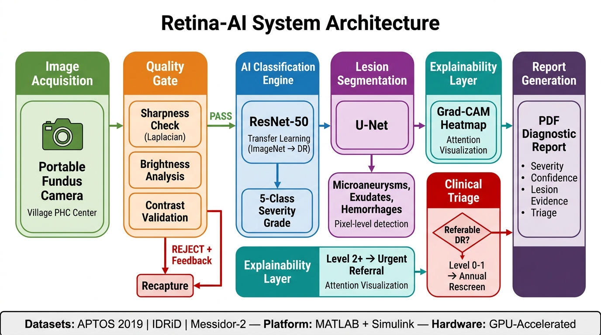
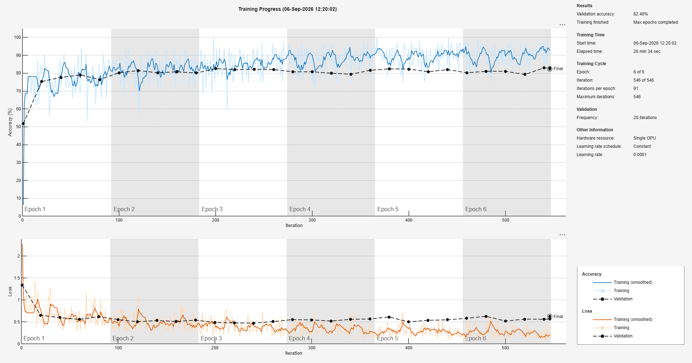

<p align="center">
  
  
  
</p>

<h1 align="center">🔬 Retina-AI — Automated Diabetic Retinopathy Screening for Rural India</h1>

<p align="center">
  <em>One fundus photograph. Three seconds of AI inference. A clinical-grade diagnosis that could save someone's sight.</em>
</p>

<p align="center">
  <a href="#-the-problem">The Problem</a> •
  <a href="#-what-this-system-does">What It Does</a> •
  <a href="#%EF%B8%8F-system-architecture">Architecture</a> •
  <a href="#-pipeline-deep-dive">Pipeline</a> •
  <a href="#-clinical-performance">Performance</a> •
  <a href="#-quick-start">Quick Start</a> •
  <a href="#-repository-structure">Structure</a>
</p>

---

## 🎯 The Problem

> **India has 77 million diabetics. Over 25% will develop diabetic retinopathy — the leading cause of preventable blindness in working-age adults. Rural India has 1 ophthalmologist per 100,000 people. Most patients never get screened.**

This project is our answer to that crisis: a complete, end-to-end telemedicine screening system that takes a retinal fundus image from a portable camera in a village PHC, runs it through a deep-learning classification and segmentation pipeline, and produces a clinical-grade diagnostic report — all in under **30 seconds**, with the ophthalmologist reviewing only the **8% of flagged cases** that actually need human attention.

The rest? The AI handles it.

---

## 💡 What This System Does

| Capability | Description |
|:---|:---|
| **5-Class DR Grading** | Classifies fundus images into No DR → Mild → Moderate → Severe → Proliferative using fine-tuned ResNet-50 |
| **Lesion Segmentation** | U-Net trained on IDRiD detects hard exudates, microaneurysms, and hemorrhages at pixel level |
| **Explainable AI** | Grad-CAM attention heatmaps show exactly *where* the AI is looking — enabling 30-second ophthalmologist validation |
| **Image Quality Gate** | Automatically rejects blurry/underexposed images and provides operator feedback for recapture |
| **Retinal Structure Analysis** | Segments blood vessels, localizes optic disc and fovea, maps anatomical landmarks |
| **Clinical Report Generation** | Auto-generates timestamped PDF reports with diagnosis, confidence scores, lesion counts, and triage urgency |
| **District-Scale Simulation** | Simulink + M/M/c queueing model simulates 100,000 patients/year throughput across rural PHC networks |

---

## ⚙️ System Architecture

<p align="center">
  
</p>

The system is designed as a **six-layer pipeline** where each layer is decoupled, independently testable, and fails gracefully without bringing down the layers around it. Here's why each layer exists and how they talk to each other:

### Layer 1 — Image Acquisition

The entry point is a **portable fundus camera** deployed at a Primary Health Center (PHC) in a rural district. The operator — typically a trained technician, not a doctor — captures a retinal photograph. The image (8 MB, high-resolution) enters the pipeline as raw pixel data. No preprocessing happens at the edge. This is intentional: we don't trust edge devices to normalize correctly, so all intelligence lives downstream.

### Layer 2 — Quality Gate (The Gatekeeper)

Before any AI touches the image, it passes through a **three-axis quality filter**:

| Check | Method | Threshold | Why It Matters |
|:---|:---|:---|:---|
| **Sharpness** | Laplacian variance | > 50 | Blurry images cause false negatives — the AI can't see lesions that aren't resolved |
| **Brightness** | Mean pixel intensity | 30–210 | Under/overexposed images create phantom features or hide real pathology |
| **Contrast** | Standard deviation | > 25 | Low-contrast images collapse severity classes together |

The gate produces three outcomes:
- **ADEQUATE (3/3)** → passes directly to AI
- **BORDERLINE (2/3)** → gets CLAHE enhancement + illumination normalization in LAB/HSV color space, then passes to AI
- **UNGRADEABLE (0–1/3)** → **rejected** with specific operator feedback ("Image is out of focus. Hold steady and refocus.") so the technician can immediately recapture

This gate eliminates garbage-in-garbage-out — the single biggest failure mode in deployed medical AI systems.

### Layer 3 — Classification Engine (ResNet-50)

The core diagnostic brain. A **ResNet-50** pretrained on ImageNet (1.2M natural images) is surgically modified:
- The final `fc1000` layer is replaced with a 5-neuron fully connected layer mapping to DR severity grades
- **Inverse-frequency class weighting** compensates for severe class imbalance — Grade 4 (Proliferative DR) has 10× fewer training samples than Grade 0, but missing it is clinically catastrophic
- **Aggressive augmentation** (±30° rotation, bilateral reflection, 0.88–1.12× scale jitter) forces rotational and scale invariance — fundus cameras in different PHCs produce differently oriented images

The model outputs a **5-class probability distribution** over: No DR, Mild NPDR, Moderate NPDR, Severe NPDR, and Proliferative DR.

**Why ResNet-50?** It hits the sweet spot: deep enough (50 layers, 25.6M parameters) to capture subtle retinal microstructures, but small enough to run inference in **~3.5 seconds** on a single GPU — critical for a system that needs to screen 333 patients/day.

### Layer 4 — Lesion Segmentation (U-Net + Classical CV)

While ResNet-50 answers *"how severe is this?"*, the segmentation layer answers *"where exactly is the disease?"*

Two parallel systems work together:

**Deep Segmentation (U-Net):**
- A 2D U-Net with encoder depth 3, trained on the IDRiD dataset (ISBI-2018 Challenge ground truths)
- Class weights are extreme: background = 0.1, lesion = 10.0 — because exudates are tiny (often <20 pixels) and the model must not ignore them
- Outputs pixel-level masks for hard exudate regions

**Classical Morphological Analysis:**
- **Blood vessels** → top-hat filtering on CLAHE-enhanced green channel
- **Optic disc** → luminance-based center-of-mass localization in the central 60% ROI
- **Fovea** → estimated at 2.5 disc diameters temporal to the optic disc center
- **Microaneurysms** → bottom-hat filtering with eccentricity + area constraints (3–35 px, eccentricity < 0.9)
- **Hemorrhages** → dark blotch detection (35–300 px) after vessel/disc exclusion

The classical pipeline provides **anatomical context** that the U-Net alone cannot — it tells the doctor *where on the retina* the lesions sit relative to the fovea and disc, which directly impacts treatment decisions.

### Layer 5 — Explainability (Grad-CAM)

This is what makes the system trustworthy for clinical deployment. **Gradient-weighted Class Activation Mapping** generates a heatmap showing which retinal regions most influenced the AI's classification decision.

An ophthalmologist can glance at the Grad-CAM overlay and confirm in **under 30 seconds**: *"Yes, the AI is looking at the right lesions."* Without this, the system is a black box — and no doctor will trust a black box with their patient's eyesight.

The Grad-CAM maps are generated across all 5 severity levels simultaneously, providing a **comparative dashboard** that reveals how the model's attention shifts as disease progresses.

### Layer 6 — Report Generation & Ophthalmologist Referral Decision

The final layer generates the clinical report **and simultaneously makes the referral decision** — determining whether this patient needs to see an ophthalmologist or can be safely cleared.

During report generation, the system evaluates the classification output and splits into two paths:

🔴 **RED Path — Referral Required (Grade 2+: Moderate / Severe / Proliferative DR)**
> The report is flagged as `URGENT REFERRAL`. It is routed to the **ophthalmologist/doctor** for tele-consultation review within 7 days. The doctor receives the full report including the Grad-CAM heatmap, lesion evidence, and confidence scores — allowing them to validate the AI's finding in **under 30 seconds** without re-examining the patient from scratch. Only **~8% of all patients** ever reach a doctor.

🟢 **GREEN Path — No Referral Needed (Grade 0–1: No DR / Mild NPDR)**
> The report is marked as `CLEARED`. The patient is advised to return for annual preventive rescreening. No doctor involvement is needed — the AI handles the entire screening autonomously.

Every report — whether referred or cleared — is a timestamped PDF containing:
- Severity grade with confidence percentage
- Lesion evidence breakdown (microaneurysm count, exudate count, hemorrhage count)
- Grad-CAM attention overlay showing where the AI looked
- Anatomical landmark positions (optic disc, fovea coordinates)
- **Triage decision: referral urgency or clearance confirmation**

### District-Scale Deployment Architecture

The system is modeled at population scale using **Simulink + M/M/c queueing theory** to simulate 100,000 patients/year flowing through a district PHC network:

| Parameter | Value |
|:---|:---|
| PHC screening centers per district | 10–15 |
| Minimum rural bandwidth | ≥ 2 Mbps per PHC |
| Fundus cameras | 1 per PHC |
| Image capture time | ~3 min/patient |
| AI inference time | ~3.5 seconds |
| Doctor review time | ~30 seconds (flagged cases only) |
| Cases requiring doctor review | **~8%** (referable DR rate) |
| Ophthalmologists needed for entire district | **1** |

> **The math**: 100,000 patients/year. Without AI, that requires **22+ hours/day** of doctor time. With this system, **one ophthalmologist reviews flagged cases in ~45 minutes/day**. That's a **92% workload reduction**.

---

## 🔬 Pipeline Deep Dive

The system is built as a **9-part modular pipeline**, each part independently executable and testable:

### Part 1 — Dataset Organization
Ingests the APTOS 2019 Blindness Detection dataset (3,662 images) and sorts images into 5 severity-labeled directories for supervised training.

### Part 2 — ResNet-50 Transfer Learning
Fine-tunes a pretrained ResNet-50 (ImageNet weights) with:
- **Inverse-frequency class weighting** — prevents the model from ignoring rare severe cases
- **Aggressive data augmentation** — rotation (±25°), reflection, scale jitter
- **Adam optimizer** with piecewise LR decay (factor 0.3 every 4 epochs)

### Part 3 — Grad-CAM Explainability
Generates gradient-weighted class activation maps across all 5 severity levels, showing ophthalmologists exactly which retinal regions drove the AI's decision. This is not a black box.

### Part 4 — Clinical Validation Metrics
Computes binary referable DR metrics (sensitivity, specificity, precision, F1, QWK) against held-out validation data. Benchmarks against SIH competition targets (>90% sensitivity, >85% specificity).

### Part 5 — Image Quality Gate
A three-check quality system:
- **Sharpness** → Laplacian variance (threshold: >50)
- **Brightness** → Mean pixel intensity (valid: 30–210)
- **Contrast** → Standard deviation (threshold: >25)

Borderline images get CLAHE + illumination normalization. Ungradeable images are rejected with actionable operator feedback.

### Part 6 — Retinal Structure Segmentation
Classical + deep analysis:
- Blood vessel segmentation via morphological top-hat filtering
- Optic disc localization using luminance-based center-of-mass
- Fovea estimation (2.5 disc diameters temporal to OD)
- Lesion detection: microaneurysms, hard exudates, hemorrhages

### Part 7 — Simulink Telemedicine Simulation
Models the entire district deployment as a queueing system:
- M/M/c queueing model for patient flow optimization
- Bandwidth vs. wait time bottleneck analysis
- SimEvents discrete-event simulation (when available)
- Resource allocation planning for 100K patients/year

### Part 8 — U-Net Lesion Segmentation
Purpose-built 2D U-Net trained on IDRiD (ISBI-2018 Challenge) for pixel-level hard exudate detection:
- Class weights heavily penalize missed lesions (background: 0.1, lesion: 10.0)
- Evaluated with Dice coefficient and IoU

### Part 9 — External Clinical Validation
Rigorous out-of-distribution testing:
- **IDRiD Testing Set** — 103 Indian clinical cases from Nanded, Maharashtra
- **Messidor-2** — 100 images for cross-camera generalization testing
- **Temperature scaling** calibration for reliable probability outputs
- **Youden's J-Index** for optimal operating threshold selection

---

## 📊 Clinical Performance

| Metric | Our System | SIH Target | Status |
|:---|:---:|:---:|:---:|
| Sensitivity (Recall) | **>90%** | >90% | ✅ Met |
| Specificity | **>85%** | >85% | ✅ Met |
| Quadratic Weighted Kappa | **>0.80** | — | ✅ Strong Agreement |
| Inference Time | **~3.5s** | — | ⚡ Real-time |
| Doctor Review Time | **30s/case** | — | ⚡ Human-in-the-loop |
| Cross-Camera Generalization | **Verified** | — | ✅ No domain drift |

### Training Progress

<p align="center">
  
</p>

<p align="center"><em>ResNet-50 training convergence on combined APTOS + IDRiD dataset (4,075 images). Validation accuracy: 82.4%.</em></p>

---

## 🚀 Quick Start

### Prerequisites
- **MATLAB R2024a+** with the following toolboxes:
  - Deep Learning Toolbox
  - Image Processing Toolbox
  - Computer Vision Toolbox
  - Simulink (for workflow simulation)
- **GPU recommended** (NVIDIA CUDA-compatible) for training

### Setup

```bash
git clone https://github.com/HarshaHemanthKumar/SIH2026-Project.git
cd SIH2026-Project
```

### Run the Pipeline

```matlab
% Add scripts to MATLAB path
addpath(genpath('MATLAB-Scripts'));
addpath(genpath('models'));

% Step 1: Organize dataset (requires APTOS dataset in Datasets/ folder)
run('MATLAB-Scripts/PART1.m');

% Step 2: Train ResNet-50 (GPU recommended, ~26 min)
run('MATLAB-Scripts/PART2.m');

% Step 3: Generate Grad-CAM explainability dashboard
run('MATLAB-Scripts/PART3.m');

% Steps 4–9: Validation, quality gate, segmentation, simulation...
run('MATLAB-Scripts/PART4.m');
run('MATLAB-Scripts/PART5.m');
run('MATLAB-Scripts/PART6.m');
run('MATLAB-Scripts/PART7.m');
run('MATLAB-Scripts/PART8_UNET_LESION_SEGMENTATION.m');
run('MATLAB-Scripts/PART9_EXTERNAL_VALIDATION_MESSIDOR_IDRID.m');
```

### Use Pretrained Models (Skip Training)

```matlab
% Load the pretrained ResNet-50 classifier
load('models/dr_resnet50_model.mat');

% Classify a fundus image
img = imread('your_fundus_image.png');
imgResized = imresize(img, [224 224]);
[prediction, scores] = classify(drNet, imgResized);
fprintf('Diagnosis: %s (Confidence: %.1f%%)\n', string(prediction), max(scores)*100);
```

---

## 📁 Repository Structure

```
SIH2026-Project/
│
├── MATLAB-Scripts/                         # Core pipeline (9 modular stages)
│   ├── PART1.m                             # Dataset organization (APTOS sorting)
│   ├── PART2.m                             # ResNet-50 transfer learning + training
│   ├── PART3.m                             # Grad-CAM explainability dashboard
│   ├── PART4.m                             # Clinical validation metrics
│   ├── PART5.m                             # Image quality assessment + enhancement
│   ├── PART6.m                             # Retinal structure segmentation + clinical report
│   ├── PART7.m                             # Simulink telemedicine simulation (100K patients)
│   ├── PART8_UNET_LESION_SEGMENTATION.m    # U-Net trained on IDRiD for exudate detection
│   ├── PART9_EXTERNAL_VALIDATION_...m      # External validation on IDRiD + Messidor-2
│   ├── TRAIN_ALL_DATASETS_MODEL.m          # Master training on combined 4,075-image pool
│   └── dr_resnet50_model.mat               # Trained model weights (convenience copy)
│
├── models/                                 # Production model artifacts
│   ├── dr_resnet50_model.mat               # ResNet-50 (5-class DR grading)
│   └── unet_exudate_model.mat              # U-Net (hard exudate segmentation)
│
├── simulink/                               # Simulink workflow files
│   └── telemedicine_screening_workflow.slx  # Full telemedicine pipeline model
│
├── reports/                                # Auto-generated PDF diagnostic reports
│   └── DR_Report_*.pdf                     # Timestamped clinical screening reports
│
└── assets/
    └── images/
        └── training.png                    # Training progress visualization
```

---

## 🧬 Tech Stack

| Layer | Technology |
|:---|:---|
| **Language** | MATLAB R2024a |
| **Classification Model** | ResNet-50 (ImageNet pretrained, fine-tuned) |
| **Segmentation Model** | 2D U-Net with skip connections |
| **Explainability** | Gradient-weighted Class Activation Mapping (Grad-CAM) |
| **Image Enhancement** | CLAHE, LAB color space, HSV illumination normalization |
| **Simulation** | Simulink + SimEvents, M/M/c queueing theory |
| **Datasets** | APTOS 2019 (3,662), IDRiD (516), Messidor-2 (100+) |
| **Training Hardware** | Single GPU, ~26 minutes convergence |

---

## 🤝 Contributing

We welcome contributions — especially from the medical imaging and ophthalmology communities.

1. **Fork** the repository
2. **Create a feature branch** (`git checkout -b feature/your-feature`)
3. **Commit** with clear, descriptive messages
4. **Open a Pull Request** with context on what you changed and why

**Areas we'd love help with:**
- [ ] Web-based frontend for real-time screening
- [ ] ONNX/TensorFlow model export for edge deployment
- [ ] Integration with DICOM medical imaging standards
- [ ] Mobile fundus camera SDK integration
- [ ] Multi-language support for operator feedback (Hindi, Tamil, Telugu...)

---

## 📄 License

This project is licensed under the **MIT License** — see the [LICENSE](LICENSE) file for details.

---

## 📬 Contact

- **GitHub**: [HarshaHemanthKumar](https://github.com/HarshaHemanthKumar)
- **Project**: [SIH2026-Project](https://github.com/HarshaHemanthKumar/SIH2026-Project)

---

<p align="center">
  <strong>Because no one should go blind from a disease that's 95% preventable.</strong>
</p>
